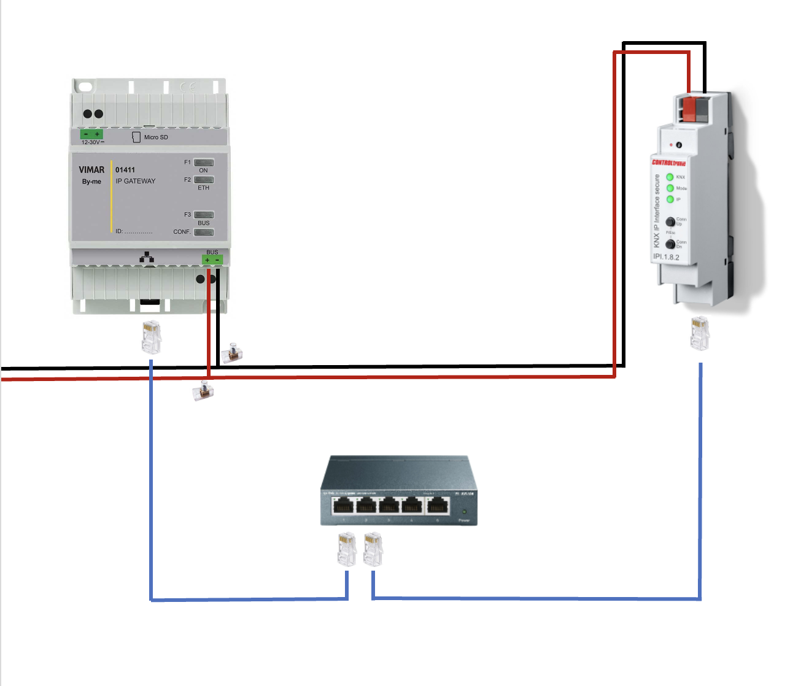

# Installazione Interfaccia KNX/IP

Il primo passo per poter collegare il Gateway Vimar (01411) su HomeAssistant è acquistare una KNX/IP Interface.

 

## Scopo
Un'interfaccia KNX/IP è un bridge che consente e facilita la comunicazione tra dispositivi IP (Internet Protocol) e dispositivi KNX (Konnex). 

Poichè HomeAssistant supporta nativamente KNX, utilizzeremno questa interfaccia come punto di collegamento tra HomeAssistant e il nostro impianto Vimar. 

Dal seguente [link](https://www.home-assistant.io/integrations/knx/) possiamo leggere:

> The KNX integration for Home Assistant allows you to connect to KNX/IP devices. The integration requires a local KNX/IP interface or router.

 

## Installazione
> :warning: **N.B.**: Non ho competenze da elettricista, riporto qui solo la mia esperienza. Prima di procedere verificate che quanto descritto sia in linea con le vostre aspettative o con quelle di un vostro elettricista di fiducia.

Assumendo che il Gateway 01411 abbia già il BUS collegato all'impianto domotico, tagliare il cavo rosso e, con l'aiuto di un morsetto elettrico a cappuccio, unite le due estremità tagliate con un terzo cavo rosso che andrà direttamente nella KNX/IP Interface. Ripetete lo stesso procedimento anche con il cavo nero.

 

Collegate entrambi i dispositivi alla rete locale tramite Ethernet. Se necessario, aiutatevi con un qualsiasi switch di rete.

 

## FAQ

- ### È necessario acquistare una KNX/IP Interface?
  - In diversi thread online ho letto che ultimamente Vimar fornisce insieme al Gateway 01411, anche il codice per l'integrazione con HomeKit. Questo codice è presente esclusivamente nella scatola del Gateway. Se, come me, avete buttato la scatola, voci di corridoio affermano anche che è possibile richiederlo contattando l'assistenza clienti Vimar. 
  - Io personalmente non ho percorso questa strada, e non so dire se può essere valida. Ho provato l'integrazione diretta Vimar-HomeKit da App Vimar View, ma l'esperienza non è stata delle migliori: la maggior parte dei miei dispositivi non funzionavano correttamente e rimanevano in uno stato di "Aggiorno" e "Non risponde". Pensando che l'integrazione verso HomeAssistant usasse gli stessi protocolli, ho preferito prendere la strada KNX.

- ### Quale KNX/IP Interface acquistare?
  - Io ho acquistato [questo](https://www.controltronic.com/products/knx-system-components/knx-gateways-interfaces/knx-ip-interface/) prodotto su Amazon. Fissato un range personale di 100€-200€, la mia scelta è ricaduta sul prodotto più economico venduto da Amazon (con Prime), così da rimandare indietro il prodotto nel caso non fossi riuscito a portare a termine l'integrazione. Ad oggi (2 Novembre 2023) il prodotto sembra non essere più disponibile su Amazon.